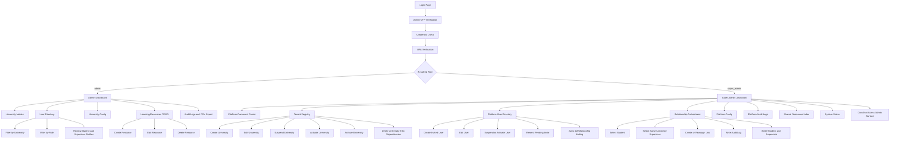
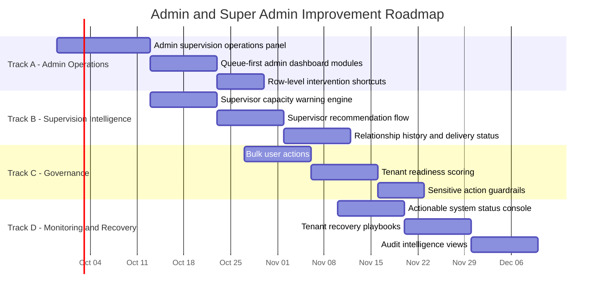

# Admin and Super Admin Current-State Flow and Improvement Plan

## Scope

This document describes what the `admin` and `super_admin` roles can do in the application today, based on the current web route and controller surface. It also proposes a pragmatic plan to improve the current state without inventing capabilities that are not yet present.

## Current-State Flow

## What Admin Can Do Now

### Authentication and Access

- Admin uses the protected web surface under `/admin`.
- Access is session-based behind `app.auth` and the admin-capable role middleware.
- The active browser flow uses OTP verification and MFA before the protected dashboard is usable.

### Operational Scope

- View the admin dashboard with university-scoped summary metrics.
- Review recent users inside the current university scope.
- Open the university user directory.
- Filter users by university and role.
- Inspect student and supervisor context attached to user rows.
- Open the university configuration screen.
- Review stored system configuration entries for a selected university.
- Open the audit log screen.
- Filter audit logs by university, action type, and date range.
- Export filtered audit logs as CSV.
- Open the learning resources screen.
- Create, edit, and delete learning resources.
- Keep resource changes auditable through audit log writes in the resource controller.

### Important Current Boundaries

- Admin does not currently have its own first-class student-supervisor assignment workflow.
- Admin does not currently manage university lifecycle actions such as suspend, activate, archive, or delete.
- Admin does not currently manage platform-wide configuration or runtime/system health.

## What Super Admin Can Do Now

### Authentication and Access

- Super admin uses the protected web surface under `/super-admin`.
- Super admin is also allowed through the `/admin` route group, so this role can operate both the platform surface and the admin surface.
- The current browser login path uses the same admin verification pattern before protected pages are usable.

### Platform Command Center

- Open the super-admin dashboard.
- Review platform-wide summary cards for universities, privileged users, suspended accounts, and recent audit events.
- Review quick actions for university onboarding, user creation, supervisor and student registration, supervision linking, config, and system status.
- Review tenant health, security watch items, recent audit activity, and recent provisioning activity.
- Review relationship-management data, including unassigned students and active supervisor load.

### Tenant Lifecycle Management

- List universities with search and status filtering.
- View total, active, suspended, and archived tenant counts.
- Create a university.
- Edit a university.
- Suspend a university.
- Activate a university.
- Archive a university when dependency checks pass.
- Delete a university when dependency checks pass.
- Open a university detail page.

### Cross-Tenant Identity Operations

- List users across all universities with search, role, university, and status filters.
- Review privileged account queues and supervisor capacity signals.
- Create invited users across roles: `student`, `supervisor`, `admin`, and `super_admin`.
- Edit users.
- Suspend or reactivate users with safeguards.
- Resend pending invitations.
- Prevent unsafe role transitions for existing students and supervisors.
- Prevent removal of the final active super admin.
- Prevent self-demotion out of super admin.

### Student-Supervisor Relationship Operations

- Link a student to a supervisor from the dashboard relationship orchestrator.
- Reassign a student to a different supervisor.
- Enforce same-university matching between student and supervisor.
- Enforce active-supervisor-only assignment.
- Write audit logs for new links and reassignments.
- Notify both the student and supervisor when a link is created or changed.
- Trigger the same notification behavior when a student record is edited and the supervisor mapping changes.

### Platform Configuration and Monitoring

- View and update platform settings such as app name, support email, default university code, AI provider, AI model, and Gemini API key.
- Review recent audit logs at platform level.
- Browse platform resources with pagination.
- Review system health details for database, mail, queue, cache, failed jobs, framework version, and related runtime signals.

## Current-State Gaps

### Shared Admin and Super Admin Gaps

- Authentication is secure but operationally heavy because admin-capable access depends on OTP plus MFA and is not yet framed as a dedicated, streamlined ops login journey.
- The platform has strong browse-and-edit surfaces, but fewer guided workflows for high-frequency operations.
- Tables remain the dominant pattern for dense management screens; they work on mobile via internal horizontal scroll, but they are not optimized for small-screen execution speed.

### Admin-Specific Gaps

- No dedicated admin workflow to assign or rebalance supervisors within a university.
- No explicit approval queue for student and supervisor onboarding or exceptions.
- Config is visible but not yet organized around task-oriented categories like mail, branding, AI, and academic workflow.
- No visible intervention shortcuts from the admin dashboard into the highest-risk operational items.

### Super-Admin-Specific Gaps

- Relationship orchestration exists, but capacity management is still simple and does not enforce target load bands, discipline fit, or rule-based assignment suggestions.
- University lifecycle management is present, but no guided tenant recovery workflow exists for suspended or archived institutions.
- Cross-tenant user management is strong, but bulk operations are limited.
- System status is informative, but it is not yet a true incident console with retry, remediation, or drill-down actions.
- Audit visibility is present, but not yet tuned for anomaly detection, actor timelines, or sensitive-change escalation.

## Improvement Plan

### Phase 1: Tighten Daily Operations

1. Add an admin-side supervision operations panel.
   Outcome: university admins can assign, rebalance, and review student-supervisor links without needing super-admin intervention for normal academic operations.

2. Add queue-first dashboard modules for both roles.
   Outcome: dashboards become action boards, not just reporting pages.
   Admin priorities: pending inactive accounts, students without supervisors, suspended students, stale resources.
   Super-admin priorities: suspended tenants, inactive privileged users, pending invitations, failed jobs, universities with weak setup completeness.

3. Add row-level “next best action” shortcuts.
   Outcome: users can act directly from lists without opening edit screens for routine operations.

### Phase 2: Make Relationship Management Smarter

1. Add supervisor load policies.
   Outcome: assignment flow can warn on overload, under-allocation, or unusual concentration.

2. Add assignment recommendations.
   Outcome: when a student is selected, the system can rank eligible supervisors by university, department, active status, and current load.

3. Add relationship history.
   Outcome: operators can see when a student was linked, reassigned, and by whom, without reconstructing it from general audit logs.

4. Add notification delivery visibility.
   Outcome: super admin can confirm whether relationship emails were queued, sent, or failed.

### Phase 3: Strengthen Tenant and Identity Governance

1. Add bulk user actions.
   Outcome: activate, suspend, resend invite, and export operations scale across tenants.

2. Add tenant readiness scoring.
   Outcome: each university gets a visible readiness score based on branding, contacts, active admins, active supervisors, resources, and config completeness.

3. Add stronger sensitive-action guardrails.
   Outcome: destructive or high-risk operations require explicit confirmation, reason capture, and richer audit metadata.

4. Add privileged-access review workflows.
   Outcome: inactive or stale admin-level accounts are surfaced for periodic certification instead of passive review.

### Phase 4: Upgrade Monitoring and Recovery

1. Turn system status into an operational console.
   Outcome: failed jobs, mail status, cache issues, and database problems become actionable from one place.

2. Add tenant recovery playbooks.
   Outcome: super admin can restore a suspended or archived tenant through a guided sequence with dependency checks and communication prompts.

3. Add audit intelligence views.
   Outcome: filter by actor, target university, object type, risk class, and sensitive transitions such as role elevation or reassignment.

## Visual Roadmap

### Delivery Tracks

| Track | Focus | Primary Owner | Supporting Owners | Success Signal |
| --- | --- | --- | --- | --- |
| `Track A` | Admin operational workflow uplift | Product + Full-stack | QA, Academic Ops | Admin can resolve common supervision tasks without super-admin escalation |
| `Track B` | Supervision intelligence | Full-stack + Data/Product | QA, Academic Ops | Linking becomes guided, load-aware, and traceable |
| `Track C` | Tenant and identity governance | Platform Admin + Full-stack | Security, QA | Tenant and privileged-user control becomes safer and faster |
| `Track D` | Monitoring and recovery | Platform Engineering | QA, Support Ops | Runtime issues become visible and actionable from one console |

### Timeline View

### Milestone Map

#### Milestone 1: Decentralize daily supervision operations

- Target window: `Late September to Mid October 2026`
- Primary owner: `Product + Full-stack`
- Scope:
   - admin-side supervision assignment panel
   - queue-first admin dashboard modules
   - quick intervention shortcuts on user rows
- Expected effect:
   - faster university-level operations
   - less super-admin dependence for routine academic workflow management

#### Milestone 2: Improve assignment quality and traceability

- Target window: `Mid October to Late October 2026`
- Primary owner: `Full-stack + Product`
- Scope:
   - supervisor load warnings
   - recommendation logic for assignment
   - relationship history
   - notification delivery visibility
- Expected effect:
   - better assignment decisions
   - stronger operational confidence that relationship updates and notices landed

#### Milestone 3: Strengthen governance and control surfaces

- Target window: `Late October to Early November 2026`
- Primary owner: `Platform Admin + Full-stack`
- Scope:
   - bulk identity actions
   - tenant readiness scoring
   - destructive-action safeguards
   - privileged access review cues
- Expected effect:
   - safer platform administration
   - easier oversight of weak tenants and risky accounts

#### Milestone 4: Turn visibility into recovery operations

- Target window: `Mid November to Early December 2026`
- Primary owner: `Platform Engineering`
- Scope:
   - incident-oriented system status console
   - guided tenant recovery playbooks
   - richer audit investigation views
- Expected effect:
   - shorter issue-resolution loops
   - better recovery from tenant and runtime incidents

### Ownership Model

| Work Area | Decision Owner | Delivery Owner | Review Stakeholders |
| --- | --- | --- | --- |
| Admin supervision workflow | Product | Full-stack | Academic Ops, QA |
| Supervisor recommendation and load policy | Product + Academic Ops | Full-stack | QA |
| Tenant lifecycle governance | Platform Admin | Full-stack | Security, QA |
| System status and recovery console | Platform Engineering | Full-stack | Support Ops, QA |
| Audit intelligence and sensitive-action review | Security + Platform Admin | Full-stack | QA |

### Suggested Execution Order

1. Deliver the admin-side supervision workflow first.
    Reason: it removes the largest day-to-day escalation bottleneck.

2. Add assignment intelligence immediately after the workflow exists.
    Reason: quality guidance matters most once linking becomes a frequent admin task.

3. Harden governance before expanding automation further.
    Reason: bulk actions and readiness scoring should arrive with stronger controls.

4. Finish with monitoring and recovery operations.
    Reason: these features become much more useful after the operational surfaces they monitor are stabilized.

## Phase 1 Implementation Checklist

This checklist translates `Milestone 1` into a delivery-ready engineering slice.

### Phase 1 Goal

- Give university admins the ability to manage supervision assignments directly.
- Make the admin dashboard more action-oriented through queue modules.
- Reduce clicks for common interventions in the admin user directory.

### Workstream A: Admin-Side Supervision Operations

#### Routes

- [ ] Add admin relationship routes in `routes/web.php` under the existing `/admin` group.
- [ ] Add a POST route for assignment, for example: `admin.relationships.assign`.
- [ ] Add a POST route for reassignment, or reuse the same assignment route with update semantics.
- [ ] Add an optional GET filter anchor or query contract for linking-focused dashboard states.

#### Controller Structure

- [ ] Move admin dashboard and user list closures out of `routes/web.php` into a dedicated web controller.
- [ ] Create or extend an admin controller layer, preferably something like:
   - `App\Http\Controllers\Web\AdminDashboardWebController`
   - `App\Http\Controllers\Web\AdminRelationshipWebController`
- [ ] Reuse the same validation and guardrail rules already proven in `SuperAdminWebController::assignStudentSupervisor()`.
- [ ] Keep assignment restricted to the admin's current university scope.
- [ ] Enforce same-university mapping between student and supervisor.
- [ ] Enforce active-supervisor-only assignment.
- [ ] Write audit logs for assignment and reassignment.
- [ ] Reuse the existing notification behavior so both student and supervisor are notified after a link change.

#### Data and Business Rules

- [ ] Restrict candidate students to the selected or session university.
- [ ] Restrict candidate supervisors to active supervisors in the same university.
- [ ] Prevent assignment when no valid supervisor exists.
- [ ] Prevent no-op reassignment when the student is already linked to the selected supervisor.
- [ ] Show clear operator feedback for success, validation failure, and guardrail failure.

#### Views

- [ ] Add a supervision operations panel to `resources/views/admin-dashboard.blade.php`.
- [ ] Include:
   - unassigned students queue
   - supervisor capacity summary
   - assignment form
   - direct link to the admin user directory filtered for intervention
- [ ] Add row-level `Link` or `Reassign` actions in `resources/views/admin/users.blade.php`.
- [ ] Reuse the shared admin shell in `resources/views/layouts/admin.blade.php` and `resources/views/admin/partials/sidebar.blade.php` so the new actions remain visually consistent.

### Workstream B: Queue-First Admin Dashboard

#### Dashboard Data

- [ ] Expand the admin dashboard dataset to include:
   - unassigned students count
   - inactive supervisors count
   - suspended students count
   - pending invitation count for the university
   - recent supervision changes
- [ ] Add one compact queue summary section and one action-oriented detail section.

#### Dashboard UX

- [ ] Convert the current admin dashboard from a metrics-only layout into a command surface.
- [ ] Add at least three high-value quick actions:
   - assign supervisor
   - review inactive accounts
   - manage resources
- [ ] Add queue cards that deep-link into filtered admin pages.

### Workstream C: User Directory Intervention Shortcuts

#### User List Enhancements

- [ ] Add contextual row actions for students and supervisors in `resources/views/admin/users.blade.php`.
- [ ] Show `Link Supervisor` for unassigned students.
- [ ] Show `Reassign Supervisor` for assigned students.
- [ ] Show a filtered jump to affected supervisees for supervisors with unusual load or inactive status.

#### Filter Improvements

- [ ] Add opinionated filter presets for:
   - unassigned students
   - inactive supervisors
   - suspended students
   - pending invites
- [ ] Preserve query string state after interventions so admins return to the same queue context.

### Workstream D: Reuse Existing Notification and Email Surface

#### Mail and Notification Behavior

- [ ] Reuse `App\Mail\PortalEmail` with the existing `supervision-linked` view.
- [ ] Keep admin-triggered assignment emails behaviorally identical to super-admin-triggered assignment emails.
- [ ] Log notification failures in the same pattern used by the super-admin relationship workflow.

### Workstream E: Audit and Safety

#### Audit Coverage

- [ ] Ensure every admin-driven assignment or reassignment records:
   - actor
   - university
   - student
   - old supervisor
   - new supervisor
   - transition type
- [ ] Ensure the admin audit log screen can surface these events with current filters.

#### Safety Checks

- [ ] Do not allow admins to link across universities.
- [ ] Do not allow assignment to inactive supervisors.
- [ ] Do not expose super-admin-only tenant lifecycle actions in the admin workflow.

### Phase 1 File Touchpoints

#### Existing Files Likely To Change

- [ ] `routes/web.php`
- [ ] `resources/views/admin-dashboard.blade.php`
- [ ] `resources/views/admin/users.blade.php`
- [ ] `resources/views/layouts/admin.blade.php`
- [ ] `resources/views/admin/partials/sidebar.blade.php`
- [ ] `app/Mail/PortalEmail.php` only if additional payload normalization becomes necessary

#### New Files Likely To Add

- [ ] `app/Http/Controllers/Web/AdminDashboardWebController.php`
- [ ] `app/Http/Controllers/Web/AdminRelationshipWebController.php`
- [ ] `tests/Feature/AdminRelationshipTest.php`

### Phase 1 Test Matrix

#### Feature Tests

- [ ] Admin can open the dashboard and see supervision queues scoped to their university.
- [ ] Admin can assign an unassigned student to an active supervisor in the same university.
- [ ] Admin can reassign a student to another active supervisor in the same university.
- [ ] Admin cannot assign across universities.
- [ ] Admin cannot assign to an inactive supervisor.
- [ ] Admin-triggered assignment sends notifications to student and supervisor.
- [ ] Admin-triggered assignment writes an audit log entry.
- [ ] Admin queue filters preserve context after action completion.

#### View and Render Tests

- [ ] The admin dashboard renders the new queue and relationship panel successfully.
- [ ] The existing `supervision-linked` email view still renders with admin-triggered payloads.

#### Browser Validation

- [ ] Real browser pass for `/admin/dashboard`.
- [ ] Real browser pass for `/admin/users`.
- [ ] Verify mobile behavior for the new queue cards and link actions.
- [ ] Verify success flash after a live assignment action.

### Definition of Done for Phase 1

- [ ] Admin can assign or reassign supervisors without using the super-admin surface.
- [ ] Every assignment stays inside university boundaries and respects active-status rules.
- [ ] Student and supervisor notifications are sent after successful link updates.
- [ ] Admin dashboard exposes queue-driven action entry points.
- [ ] Admin user rows provide direct intervention shortcuts.
- [ ] Feature tests and a browser pass validate the new workflow.

## Recommended Immediate Priorities

1. Build the admin-side supervision assignment and rebalance flow.
   Reason: the current relationship orchestration exists only at super-admin level, but assignment is an everyday university operation.

2. Add queue-based dashboards for both roles.
   Reason: the current dashboards expose data well, but the next operational bottleneck is prioritization and action routing.

3. Add supervisor recommendation logic and visible capacity warnings.
   Reason: the new linking capability is valuable, but it will produce better outcomes when assignment quality is guided instead of manual.

4. Add notification delivery status and relationship history.
   Reason: once linking becomes operationally important, admins need proof that the assignment and communications actually landed.

## Delivery Notes

- The current super-admin surface is already strong enough to serve as the command center for tenant lifecycle and identity governance.
- The largest remaining product gap is that university-level admins still depend too much on browse/edit screens and do not yet have the same workflow quality for supervision operations.
- The next round of improvement should focus on converting the most common operational tasks into guided, queue-driven actions.