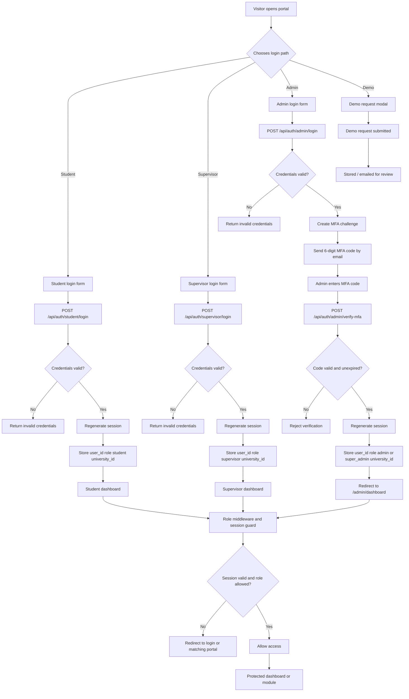
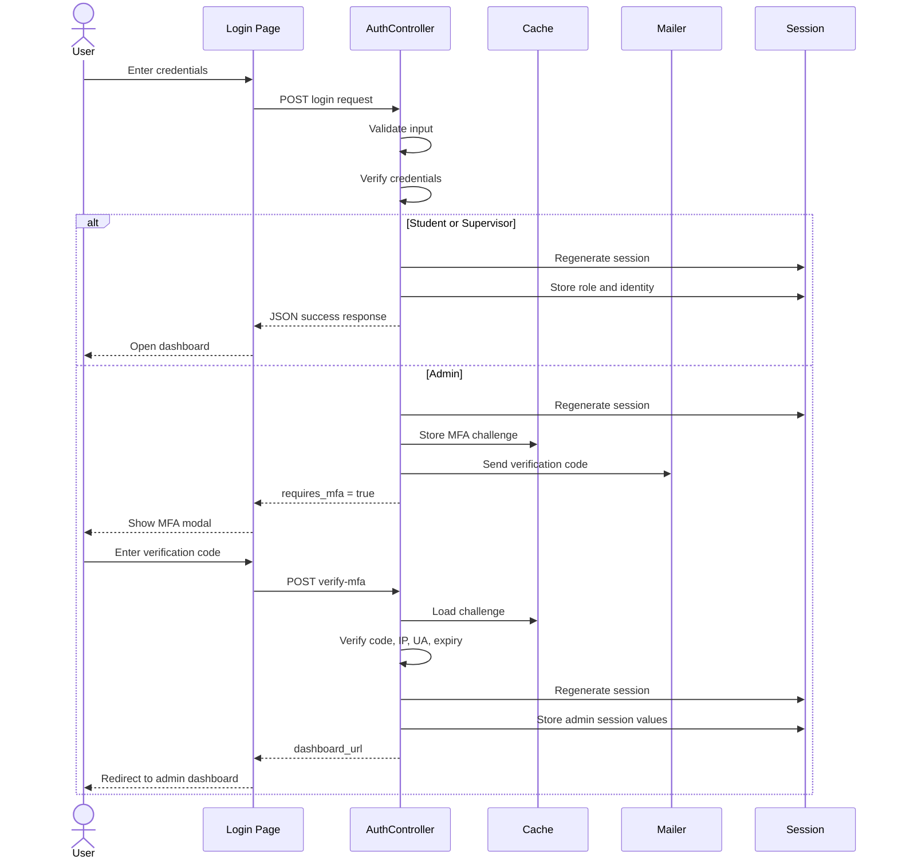
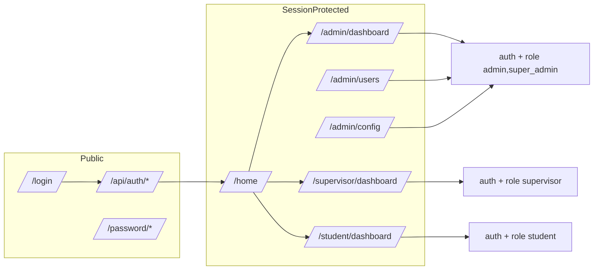
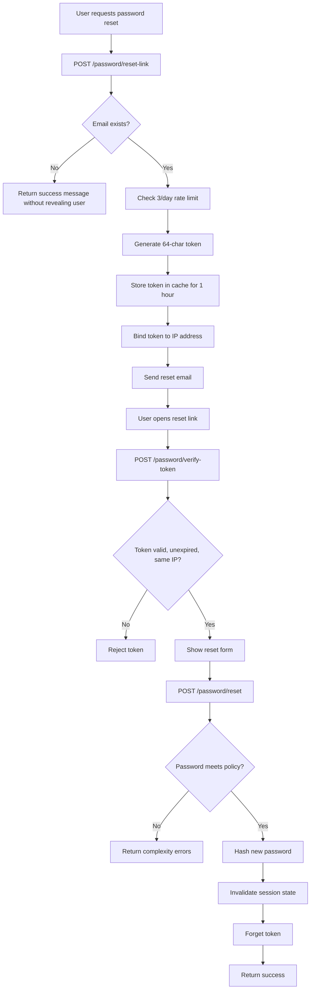
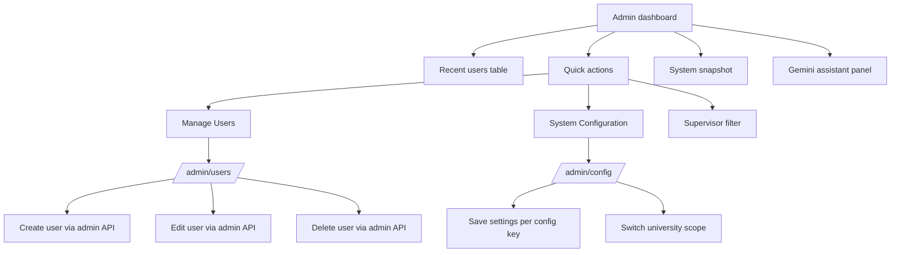
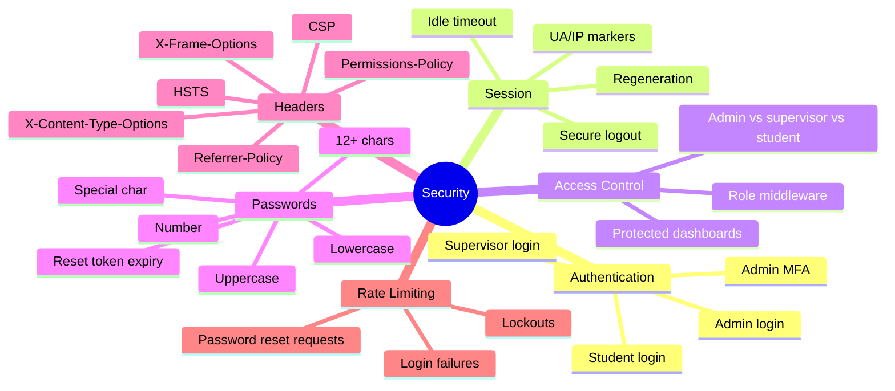

# Application Workflow Diagram

This document shows the current end-to-end workflow of the Research Supervision Portal, based on the implemented login, MFA, session, role routing, admin, and password reset flows.

## High-Level Flow

## Auth And Security Sequence

## Route And Access Flow

## Password Reset Flow

## Admin Portal Workflow

## Security Controls Summary

## Notes 

- Admin sign-in is a two-step flow: password first, then email MFA.
- Student and supervisor login complete in one step, followed by session-based route protection.
- The app uses custom middleware and controllers rather than a single centralized auth package.
- The diagram reflects the current codebase state, not the earlier aspirational security document.
