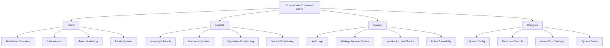
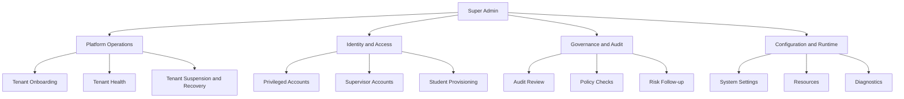
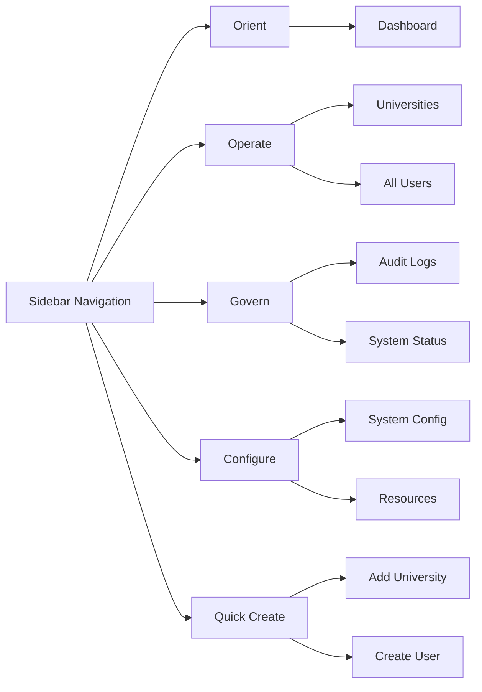
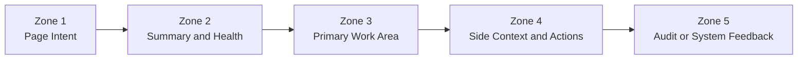
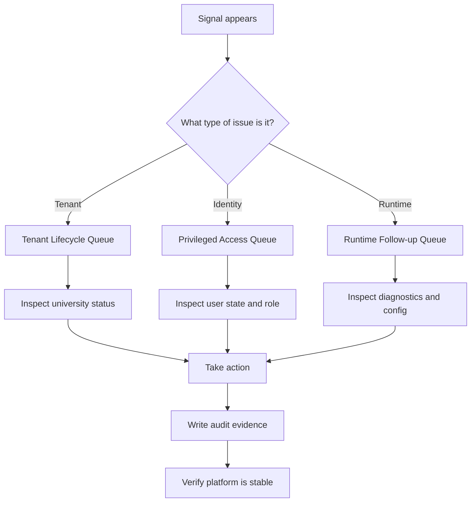

# Super Admin UI/UX Architecture Plan

This document defines the organizational structure for the super admin experience in the Research Supervision Portal. It is intended to guide interface design, page hierarchy, navigation, decision-making flow, and future module expansion.

## Executive Summary

The super admin surface should operate like a platform operations room, not a generic admin panel. The experience should help one operator move through a clear sequence:

1. Detect what matters.
2. Understand where the issue sits.
3. Decide the correct intervention.
4. Execute the action with traceability.
5. Verify that the platform is stable again.

The architecture below is organized around that sequence.

## Objective

Design the super admin workspace as a command center for cross-tenant operations. The UI should help one operator do four things well:

1. Observe platform health before acting.
2. Operate tenant and identity workflows quickly.
3. Govern security, compliance, and change history.
4. Stabilize platform configuration and runtime services.

## Core Design Thesis

The super admin experience should be optimized for platform stewardship. That means:

- Cross-tenant visibility comes before single-record editing.
- Risk and intervention should be more prominent than raw data volume.
- Navigation should follow operator intent, not database tables.
- High-impact actions should be reachable from insight panels.
- Evidence and audit context should surround privileged actions.

## Organizational Architecture

## Organizational View

This is the simplest way to think about the super admin organization model.

## UI Hierarchy

### Level 1: Command Layer

This is the dashboard surface. It answers:

- What needs attention now?
- Which tenants or users are at risk?
- Which system dependencies are unhealthy?

### Level 2: Workstream Layer

Navigation should be grouped by intent, not by database entity alone:

1. Orient
   Review the current platform state.
2. Operate
   Execute tenant, user, and onboarding actions.
3. Govern
   Audit activity and control privileged risk.
4. Configure
   Maintain shared settings and runtime dependencies.

### Level 3: Task Layer

Each workstream breaks into pages optimized for a narrow job:

- Dashboard for platform scanning.
- Universities for tenant lifecycle work.
- Users for identity operations.
- Audit Logs for forensic review.
- System Status for diagnostics.
- System Config and Resources for configuration.

## Information Architecture Rules

These rules should constrain future page design:

1. Dashboards answer questions before they expose forms.
2. List pages should begin with summary, filters, and status segmentation.
3. Detail pages should place health and risk above raw metadata.
4. Forms for privileged actions should include context and likely consequences.
5. Secondary utilities should never dominate the first screen.

## Recommended Navigation Model

## Page Zone Blueprint

Every super admin page should follow a predictable zone model.

### Zone Meaning

- Zone 1: Page title, purpose, breadcrumb, and primary CTA.
- Zone 2: Key counts, state indicators, and critical warnings.
- Zone 3: Main table, board, or diagnostic view.
- Zone 4: Related actions, quick intervention links, and secondary insight.
- Zone 5: Audit trail, validation messages, or recovery feedback.

## Dashboard Composition

The super admin dashboard should be assembled in this order:

1. Hero and quick launch
   Present identity, authority, and high-frequency actions.
2. Summary metrics
   Show platform scale and immediate counts.
3. Strategic operating structure
   Explain the four work pillars so the workspace is self-orienting.
4. Priority queues
   Surface the most consequential action lanes.
5. Tenant health board
   Compare universities by status, completeness, and activity.
6. Security and audit panels
   Help the operator investigate without leaving the dashboard.
7. Runtime and support tools
   Provide access to diagnostics and lower-frequency utilities.

## Decision Flow Architecture

The dashboard should support this operating loop.

## Role-Based UX Intent

The super admin experience is different from admin, supervisor, and student views.

- Super Admin: platform-wide orchestration, governance, and runtime ownership.
- Admin: tenant-scoped operations and local configuration.
- Supervisor: academic supervision workflows.
- Student: task progress and submission workflows.

Because of that, the super admin UI should feel like an operations console, not a standard CRUD back office.

## Priority Page Architecture

### Dashboard

Purpose: detect, triage, and dispatch actions.

- Primary success metric: time to identify the top issue.
- Dominant pattern: summary plus queues.

### Universities

Purpose: manage tenant lifecycle and tenant health.

- Primary success metric: time to inspect or intervene on a tenant.
- Dominant pattern: health table plus lifecycle actions.

### Users

Purpose: manage identity, privilege, and account state.

- Primary success metric: time to locate and correct a user issue.
- Dominant pattern: segmented directory plus status controls.

### Audit Logs

Purpose: provide evidence, traceability, and trust.

- Primary success metric: time to explain what changed.
- Dominant pattern: timeline plus filters.

### System Status

Purpose: verify service health and isolate runtime problems.

- Primary success metric: time to isolate a failing dependency.
- Dominant pattern: state cards plus remediation links.

## Interaction Principles

1. Put urgency before volume.
2. Group actions by decision flow.
3. Keep destructive or privileged actions close to context.
4. Show counts, health, and status before forms.
5. Reduce page hopping by exposing action links inside insight panels.
6. Keep terminology consistent across dashboard, sidebar, and destination pages.
7. Prefer queue-based framing for urgent work.
8. Use color to signal state, not decoration.
9. Keep audit visibility close to privileged changes.

## Visual System Direction

The UI should feel authoritative, operational, and calm.

- Layout tone: dense but readable, with strong grouping and clear hierarchy.
- Color logic: blue for platform structure, emerald for healthy state, amber for warning, rose for risk, violet for super-admin authority.
- Typography tone: strong headers, compressed labels, quiet support text.
- Card behavior: each card should either inform, compare, or trigger action.
- Motion: minimal and purposeful, mainly for dropdowns, filters, and progressive reveal.

## Component Map

| Layer | Component | Purpose |
| --- | --- | --- |
| Shell | Sidebar | Workstream-based navigation |
| Shell | Header | Breadcrumbs, profile, notifications |
| Dashboard | Hero | Identity and quick actions |
| Dashboard | Stat Cards | Platform summary |
| Dashboard | Operating Structure | Explain mental model |
| Dashboard | Priority Queues | Action-oriented triage |
| Dashboard | Health Board | Tenant comparison and intervention |
| Dashboard | Watchlists | Security and governance review |
| Dashboard | Runtime Snapshot | Service health and dependency checks |

## Ownership Model

| Workstream | Main Question | Primary Pages | Typical Actions |
| --- | --- | --- | --- |
| Orient | What needs attention now? | Dashboard | Scan, filter, prioritize |
| Operate | Which tenant or user needs intervention? | Universities, Users | Create, suspend, restore, edit |
| Govern | What changed and is it acceptable? | Audit Logs, Users | Review, trace, confirm |
| Configure | Are the platform services and defaults correct? | Config, Resources, System Status | Update, validate, stabilize |

## Rollout Plan

1. Stabilize the navigation model around Orient, Operate, Govern, and Configure.
2. Align all super admin pages to the same page-intent and zone blueprint.
3. Add page-specific queue widgets to Universities, Users, and System Status.
4. Standardize page-level summary cards, filters, and action rails.
5. Introduce saved filters and operator presets for common review workflows.
6. Add notification severity tiers for alerts, audits, and runtime failures.
7. Connect every high-risk action to nearby audit confirmation.

## Implementation Sequence

1. Dashboard
   Finalize the strategic operating structure, queues, and watchlists.
2. Sidebar and shell
   Keep the workstream navigation stable across all pages.
3. Universities
   Add health segmentation, lifecycle states, and recovery actions.
4. Users
   Improve privileged-access review and role-based filtering.
5. System Status and Config
   Connect diagnostics directly to the settings they depend on.
6. Audit Logs
   Improve traceability filters for tenant, actor, action, and outcome.

## Success Criteria

- A super admin can identify the top platform issue within 10 seconds.
- A super admin can move from insight to action in one click for common workflows.
- Navigation labels explain intent, not just entities.
- Risk-related pages feel distinct from configuration pages.
- Cross-tenant operations remain understandable as the platform grows.
- Every privileged action is visible in a nearby audit path.
- The dashboard remains useful even as tenant count and user count increase.
